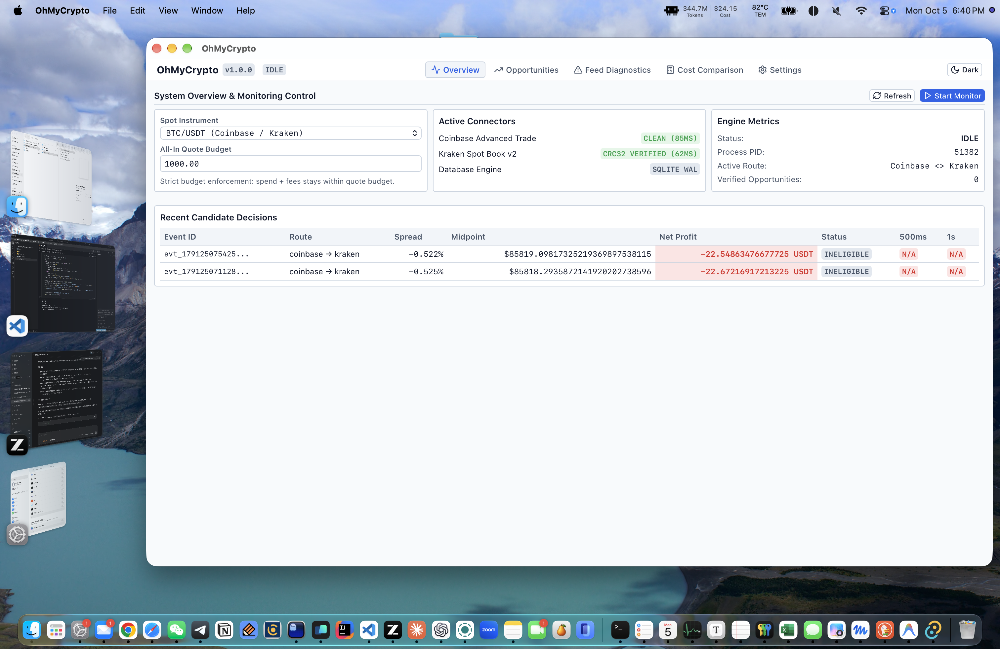

# OhMyCrypto

<p align="center">
  
</p>

<p align="center">
  <strong>Local-first cryptocurrency market opportunity verification, live feed diagnostics, and execution cost comparison engine for macOS.</strong>
</p>

<p align="center">
  <a href="LICENSE"></a>
  <a href="#"></a>
  <a href="#"></a>
  <a href="https://www.python.org/"></a>
  <a href="https://tauri.app/"></a>
  <a href="https://react.dev/"></a>
  <a href="https://www.typescriptlang.org/"></a>
  <a href="#"></a>
</p>

---



## Overview

**OhMyCrypto** is a high-precision, zero-trust macOS desktop application and command-line engine for cryptocurrency market analysis. It connects directly to public Level 2 (L2) market data streams from Coinbase and Kraken, mathematically verifying cross-venue opportunities, monitoring WebSocket feed integrity, tracking temporal persistence, and calculating optimal multi-venue execution costs.

### Core Philosophy

- **100% Local-First & Zero-Trust**: Runs entirely on your local machine. OhMyCrypto **never** requires private exchange API keys, **never** places trades, and contains **zero** tracking or remote telemetry.
- **Exact Mathematical Conservation**: Built on Python's arbitrary-precision `Decimal` engine. Disjoint-depth liquidity allocation, independent buy/sell fee schedules, and rounding conservation ensure complete financial veracity.
- **Fail-Closed Market Integrity**: Strict protocol conformance with real-time Kraken CRC32 checksum verification, Coinbase sequence gap detection, and automated REST resynchronization.
- **Deterministic Replay & Verification**: Preserves complete historical raw captures and recorded fee schedules. Replays opportunities bit-for-bit with full tamper rejection.

---

## Key Features

### 🔍 Cross-Venue Opportunity Evaluation
- Real-time comparison across Coinbase Advanced Trade and Kraken Spot public L2 order books.
- Computes gross profit, fee deductions (maker/taker tiers), net profit, and percentage yield.
- Immediate degradation handling: stale, incoherent, or CRC-failing books are quarantined from eligibility.

### ⏱️ Temporal Persistence & Exact Replay
- Tracks condition persistence across 500 ms, 1 s, and 3 s windows to differentiate transient book flickers from actionable liquidity.
- SQLite-backed durable capture and episode storage.
- Deterministic offline replay reproducing original results without fee schedule drift or missing metadata.

### 🩺 Feed Diagnostics & Offline Incident Reproduction
- Real-time feed latency tracking ($p_{50}, p_{95}, p_{99}$ quantiles) and connection health indicators.
- Incident detection engine grouping disconnects, sequence gaps, checksum failures, and rate limits.
- Offline diagnostic reproduction: exported incident bundles can be independently re-evaluated offline with zero network connectivity.

### 💰 Execution Cost Advisor & Disjoint Split Orders
- Comprehensive buy/sell cost comparison across single and multi-venue routing.
- Amount sensitivity grids ($100 to $10,000+) across quote (USD/USDT) and base (BTC/ETH) currencies.
- Split order evaluation with disjoint-depth allocation, guaranteeing child orders on the same venue do not double-count available liquidity.
- Balance feasibility checks and rebalancing transfer cost simulation.

### 🖥️ Native macOS Desktop Experience
- Lightweight, secure desktop shell built with **Tauri 2.0 (Rust)** and **React 18 / TypeScript**.
- Dual themes (Dark & Light) engineered with WCAG 2.1 AA compliant contrast and smooth transitions.
- Fully responsive layout supporting viewports from 320 px to 1440 px.
- Native notification outbox with sound alerts and a configurable quiet mode.

---

## Architecture

```
┌────────────────────────────────────────────────────────┐
│               OhMyCrypto Desktop (macOS)               │
│                                                        │
│   ┌────────────────────────────────────────────────┐   │
│   │   React 18 + TypeScript + Vite User Interface  │   │
│   │   (Overview, Opportunities, Costs, Diagnostics)│   │
│   └───────────────────────┬────────────────────────┘   │
│                           │ Tauri IPC (Commands/Events)│
│   ┌───────────────────────▼────────────────────────┐   │
│   │        Tauri 2.0 Native Shell (Rust)           │   │
│   │        Process Lifecycle & Window Host         │   │
│   └───────────────────────┬────────────────────────┘   │
└───────────────────────────┼────────────────────────────┘
                            │ JSONL IPC over Stdin/Stdout
┌───────────────────────────▼────────────────────────────┐
│         OhMyCrypto Engine Sidecar (Python 3.12)        │
│                                                        │
│   ┌───────────────────┐    ┌───────────────────────┐   │
│   │ Opportunity /     │    │  Cost Advisor /       │   │
│   │ Replay Service    │    │  Split Calculator     │   │
│   └─────────┬─────────┘    └───────────┬───────────┘   │
│             │                          │               │
│   ┌─────────▼──────────────────────────▼───────────┐   │
│   │      Financial Kernel (Arbitrary Decimal)      │   │
│   └─────────┬──────────────────────────┬───────────┘   │
│             │                          │               │
│   ┌─────────▼─────────┐    ┌───────────▼───────────┐   │
│   │ Market Connectors │    │ Storage & Repository  │   │
│   │ (Coinbase/Kraken) │    │ (SQLite + Archives)   │   │
│   └───────────────────┘    └───────────────────────┘   │
└────────────────────────────────────────────────────────┘
```

---

## Installation

### Pre-built macOS App (DMG)

1. Download the latest release from the [GitHub Releases](https://github.com/JeremyL691/OhMyCrypto/releases) page:
   - **Apple Silicon (M1/M2/M3/M4)**: `OhMyCrypto-1.0.0-arm64.dmg`
2. Open the `.dmg` file and drag **OhMyCrypto** into your `/Applications` folder.
3. Launch OhMyCrypto.

---

## Building from Source

### Prerequisites

- **macOS**: 13.0 (Ventura) or newer
- **Python**: 3.12+
- **Node.js**: 22+ (LTS) & `npm`
- **Rust**: 1.80+ & `cargo`
- **Xcode Command Line Tools**: `xcode-select --install`

### Step-by-Step Setup

1. **Clone the repository:**
   ```bash
   git clone https://github.com/JeremyL691/OhMyCrypto.git
   cd OhMyCrypto
   ```

2. **Set up the Python environment:**
   ```bash
   python3.12 -m venv .venv
   source .venv/bin/activate
   pip install --upgrade pip
   pip install -e ".[dev]"
   ```

3. **Install desktop frontend dependencies:**
   ```bash
   cd desktop
   npm install
   cd ..
   ```

4. **Run the desktop app in development mode:**
   ```bash
   cd desktop
   npm run tauri dev
   ```

---

## Verification & Testing

OhMyCrypto includes a comprehensive, fail-closed verification pipeline covering unit tests, property checks, browser journeys, and live connectors.

### 1. Offline Verification Gate
Runs all Python unit and integration tests, TypeScript typechecking, Vitest UI unit tests, Playwright browser E2E tests, and financial kernel budget invariants:
```bash
.venv/bin/python scripts/verify.py --gate offline --output .agent/evidence/offline
```
*Current status: 88 Pytest tests, 0 TS errors, 7 Vitest tests, 9 Playwright E2E tests passing.*

### 2. Live Connector Gate
Validates public REST and WebSocket connectivity against Coinbase and Kraken, measuring latency and verifying book reconstruction:
```bash
.venv/bin/python scripts/verify.py --gate live --output .agent/evidence/live
```
*Current status: 10 Coinbase + 10 Kraken spot acquisitions completed with full CRC validation.*

### 3. Native App Bundle Gate
Validates bundle structure, codesigning, and standalone sidecar IPC execution:
```bash
.venv/bin/python scripts/verify.py --gate native --app release/candidate/OhMyCrypto.app --output .agent/evidence/native
```

### 4. Release Package Verification
Verifies the release manifest, checksums, and corresponding source archive:
```bash
.venv/bin/python scripts/release.py verify --manifest release/candidate/manifest.json
```

---

## CLI Reference

OhMyCrypto provides a fully featured CLI for running headless monitors, computing execution costs, replaying historical bundles, and reproducing diagnostics.

### Monitor Live Opportunities
```bash
.venv/bin/ohmycrypto monitor --venues coinbase,kraken --market BTC/USDT --min-spread-bps 5
```

### Execution Cost Comparison
```bash
.venv/bin/ohmycrypto compare --amount 5000 --side buy --venues coinbase,kraken --symbol BTC/USDT
```

### Deterministic Replay
```bash
.venv/bin/ohmycrypto replay --bundle /path/to/replay_bundle.json
```

### Offline Diagnostic Reproduction
```bash
.venv/bin/ohmycrypto diagnostics reproduce --bundle /path/to/incident_bundle.json
```

---

## Project Structure

```
OhMyCrypto/
├── src/ohmycrypto/          # Core Python Engine
│   ├── adapters/            # Coinbase and Kraken L2 connectors
│   ├── domain/              # Models, DTOs, and financial kernel
│   ├── interfaces/          # CLI and JSONL sidecar engine
│   ├── notifications/       # SQLite-backed durable outbox
│   ├── services/            # Opportunity, Cost, Diagnostics, and Monitor services
│   └── storage/             # SQLite database and compressed archive manager
├── desktop/                 # Tauri Desktop Application
│   ├── src/                 # React UI components, styles, and IPC bindings
│   ├── src-tauri/           # Rust native shell, windowing, and menu bindings
│   └── tests/               # Vitest component tests and Playwright E2E tests
├── scripts/                 # Verification, packaging, and soak harnesses
│   ├── verify.py            # Unified verification engine (offline, live, native)
│   ├── release.py           # Packaging, signing, notarization, and aggregation
│   └── soak.py              # Bounded operational resource monitor
├── tests/                   # Python Test Suites
│   ├── unit/                # Unit tests, reproductions, and verifier negatives
│   ├── integration/         # Stream, lifecycle, and bounded resource scenarios
│   └── replay/              # Deterministic opportunity replay test suite
├── docs/                    # Documentation and screenshots
├── release/                 # Packaged distribution candidates and manifests
├── LICENSE                  # GNU General Public License v3.0
├── NOTICES.md               # Third-party software notices
└── README.md                # Project documentation
```

---

## Security & Privacy

- **Read-Only Public Data**: All market data is acquired from unauthenticated public exchange APIs. No private API keys or trading secrets are stored or transmitted.
- **Local SQLite Database**: Historical market events and settings remain on your local disk at `~/.ohmycrypto/`.
- **GPL-3.0 Compliance**: In accordance with the GNU General Public License, every binary distribution provides access to the complete machine-readable Corresponding Source code.

---

## License

OhMyCrypto is licensed under the [GNU General Public License v3.0 (GPL-3.0-only)](LICENSE).  
Third-party component acknowledgments and license notices are documented in [NOTICES.md](NOTICES.md).
